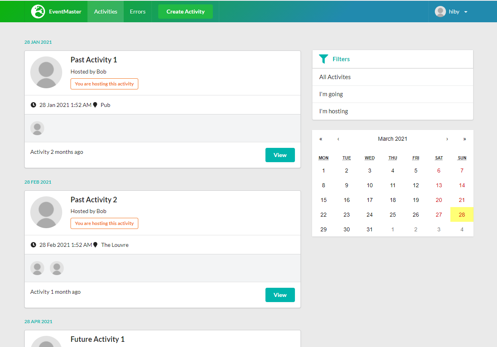

# EventMaster
> A .Net 5 project to collect event information

## Table of contents
* [General info](#general-info)
* [Screenshots](#screenshots)
* [Technologies](#technologies)
* [Setup](#setup)
* [Features](#features)
* [Inspiration](#inspiration)

## General info
EventMaster is a .Net 5 project to collect and manage event information. It is a personal project for me to practice my .Net skills.

## Screenshots


## Technologies
* React
* Typescript
* Mobx
* .NET 5.0
* AutoMapper
* SQLite

## Setup

### Setup and run .Net API
```
cd .\API\
dotnet watch run
```

### Setup and run React client side
```
cd .\client-app\
npm i
npm start
```

### Drop database before Seed data
```
dotnet ef database drop -p Persistence -s API
```

## Features
* User able to CURD activities
* User able to attend activities
* Host user able to cancel activities

## Inspiration
Add here credits. Project inspired by https://www.udemy.com/course/complete-guide-to-building-an-app-with-net-core-and-react
